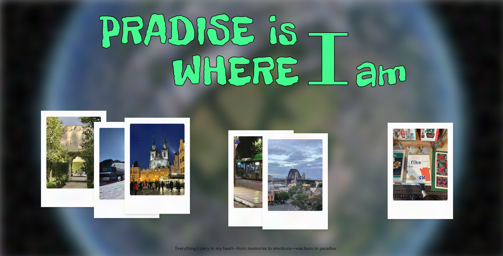
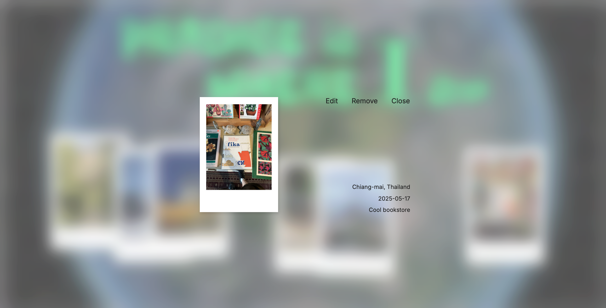

# 🌍 Fullstack Travel Memory Map Project



This is a fullstack solo project that allows users to visually record and share travel memories.  
Users can click anywhere on the main page to leave a memory by uploading a photo and entering information such as **where**, **when**, and **what was impressive**.  
Saved memories are displayed as Polaroid-style images, and clicking them reveals detailed info with **Edit** and **Remove** options.

## 🛠️ Tech Stack

### Frontend
- React (with **MCP auto-coding via Figma + Cursor**)
- CSS
- Axios

### Backend
- Node.js + Express
- PostgreSQL
- AWS S3 (image storage)
- Docker & Docker Compose

### DevOps
- Jenkins for CI/CD pipeline  
- Docker for containerization  
- AWS EC2 for hosting 

### Design & Development Tools
- Figma for UI/UX design  
- Figma MCP for automated code generation  
- Cursor AI editor for code completion and refactoring

## 📌 Main Features

- 🌍 Click anywhere on screen to leave a memory
- 🖼️ Upload photo + travel info (location, date, impression)
- 🔁 Display memory as Polaroid image at clicked position
- ✏️ Edit or delete individual memories
- ⚙️ CI/CD pipeline with GitHub + Jenkins + Docker
- 💻 MCP-based frontend automatically generated from Figma design
- 📦 Fully containerized backend, frontend, and database

## 📂 Project Structure

```bash
startedFromBottom/
├── backend/
│ ├── routes/
│ │ └── travel.js
│ ├── upload.js
│ ├── .env
│ └── index.js
│ └── run-test.sh
│ └── package.json
│
├── frontend/
│ ├── public/
│ │ ├── index.html
│ ├── src/
│ │ ├── pages/
│ │ │ └── index.jsx
│ │ ├── styles/
│ │ │ └── app.css
│ │ └── index.js
│ ├── package.json
│ └── .env
│
├── init.sql
├── docker-compose.yml
├── Jenkinsfile
├── README.md
```

## 🔧 Setup and Installation

### Prerequisites
- Node.js and npm
- Docker
- Jenkins
- AWS account (for deployment)
- Figma account (for design)
- Cursor editor (for development)

### Local Development
1. Clone the repository
```bash
git clone https://github.com/summeree22/startedFromBottom.git
cd startedFromBottom
```

2. Install dependencies
```bash
# Install frontend dependencies
cd frontend
npm install

# Install backend dependencies
cd ../backend
npm install
```

3. Set up environment variables
```bash
# Create .env files for both frontend and backend with appropriate variables
# If you want to expreience CI/CD, create jenkins credentials to use the jenkins pipeline
```

4. Run the application
```bash
# Start backend
cd backend
node index.js

# Start frontend (in a new terminal)
cd frontend
npm start

# Start with docker-compose file
docker-compose down
docker-compose up -d
```

> You can test these with Postman using raw JSON + `multipart/form-data` for image upload.

## 📮 API Endpoints

| Method | Endpoint         | Description            |
|--------|------------------|------------------------|
| GET    | `/api/travel`    | Fetch all entries      |
| POST   | `/api/travel`    | Upload new memory      |
| PUT    | `/api/travel/:id`| Update memory info     |
| DELETE | `/api/travel/:id`| Delete memory          |


When click a polaroid, this form pops up


Editing...

## 🔄 Jenkins CI/CD Pipeline

### Jenkinsfile Summary:

- GitHub Webhook triggers Jenkins
- Jenkins builds images via `docker build`
- Push the latest docker image to Docker Hub via `docker push`
- Replaces containers via `docker stop, rm and run`
- AWS & DB credentials injected from Jenkins Credential Manager

```groovy
pipeline {
    agent any
    environment {
        AWS_ACCESS_KEY_ID = credentials('aws-access-key')
        AWS_SECRET_ACCESS_KEY = credentials('aws-secret-key')
        AWS_S3_BUCKET_NAME = credentials('aws-s3-bucket')
        AWS_REGION = credentials('aws-region')
        FRONTEND_URL = credentials('FRONTEND_URL')
    }
    stages {
        stage('Build and Deploy') {
            steps {
                sh 'docker stop && docker rm'
                sh 'docker build && docker push'
                sh 'docker run'
            }
        }
    }
}
```

## 🤖 MCP Integration for Frontend Development


This project uses **Figma MCP** (Midjourney Code Prototype) combined with **Cursor AI** to automatically generate React frontend code from Figma UI designs, streamlining the development process.

### How MCP is integrated:

- UI/UX design is created in **Figma**
- MCP plugin generates React component code based on the design and developer prompts
- Generated code is refined and completed using **Cursor AI editor**

### Reference Repository for MCP Integration

You can check out the MCP auto-coding workflow used in this project at:

[https://github.com/sonnylazuardi/cursor-talk-to-figma-mcp#](https://github.com/sonnylazuardi/cursor-talk-to-figma-mcp#)

This repository contains the sample React project generated by MCP and Cursor AI, demonstrating how designs are converted into working code automatically.

## 🐛 Common Issues & Fixes

- **POST request not working but GET is fine**
  - Make sure `Content-Type` is set to `multipart/form-data` when sending image.
  - Confirm that AWS credentials are correctly injected via Jenkins.

- **Docker build fails with `no space left on device`**
  ```bash
  docker image prune -af
  ```

- **S3 upload fails with `AccessDenied`**
  - Ensure S3 bucket policy allows `PutObject` for the IAM user or role.
  - Double-check the `aws-s3-bucket` value in Jenkins credentials.

- **Image not displaying or 403 from S3**
  - Make uploaded files public or generate signed URLs (currently using public-read ACL).

- **CORS error in frontend**
  - Backend must include CORS headers. If needed, update `app.use(cors())` with specific origin.

- **Axios error: "Network Error" or 500**
  - Check if frontend is calling the correct backend endpoint via `REACT_APP_API_URL`.

- **Frontend UI broken or off-position**
  - If you're using MCP-generated code from Figma, make sure the latest design was synced correctly.
  - Avoid manually editing the generated code — instead, adjust in Figma and regenerate.

- **Jenkins container loses credentials on restart**
  - Ensure credentials are stored in Jenkins > Manage Credentials, not injected via `.env`.

## ✨ Future Improvements

- User authentication (OAuth or JWT)
- Map-based memory positioning using Leaflet or Mapbox

## 🙋 Contact

Created with ❤️ by [Heesun Park](https://github.com/summeree22)  
Feel free to open an issue or pull request if you'd like to contribute!
